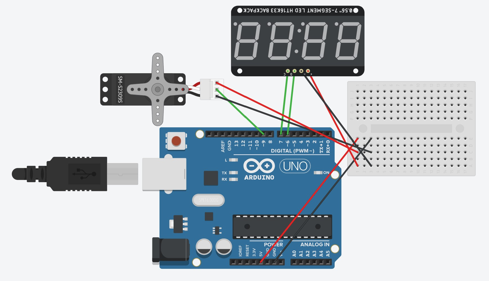

# MotionTracking-Arduino
Arduino Setup with object tracking using the mediapipe library

---

## Initialize and Install Dependencies

``` bash
$ pipenv shell
```

``` bash
$ pipenv install
```

---
### Board settings
locate `/src/arduino-sketch/sketch.json`

<b>Uno</b>
> "fqbn": "arduino:avr:uno"
> "name": "Arduino Uno"

<b>Nano (old Bootloader)</b>
> "fqbn": "arduino:avr:nano:cpu=atmega328old"   
> "name": "Arduino Nano"

---
### Arduino-CLI 

**Generate sketch.json Config**

``` bash
$ arduino-cli board attach -b COM5 -v
```

**Upload**
``` bash
$ arduino-cli compile --upload
```

**Add Library**

* `arduino-cli lib install <lib Name>`
* `arduino-cli lib install <lib name>@1.0.0`
* `arduino-cli lib install --git-url https://github.com/arduino-libraries/WiFi101.git`
* `arduino-cli lib install --zip-path /path/to/<library>.zip`

---
### Description

**Servo-MotionTracking**


This component tracks and detects hands in real time. 
The video-frame feed is read using the `<video>` element/OpenCV library. 

The HandTracking module uses mediapipe library by Google. This Neural Network library has been trained using thousands of sample images, manually categorized and labelled. The weights and biases obtained is what helps in detecting the object. Each pixel of the image is passed to the Network as an input and what is obtained is a list of (x, y) cartesian coordinates. 

These coordinates are then passed to a graphics library which draws them onto the video-frame/screen. A single (x, y) coordinate of choice is chosen and written to the serial. This serial-based-communication is estabilished using the serialport/p5.serialport library/pyserial library.


This input is then read from the incoming serial data by the arduino board. These coordinates are then passed on as angles to the servo motor. Thus this component tracks hands and sends their coordinates to the servo motor which results in some change in their angle. 

**Components**
- Servo Motors: MG90S Mini
- TM1637 Display module
- Arduino UNO
- Google mediapipe JavaScript/Python
- serialport/p5.serialport
- Webcam
- OpenCV
- pyserial

---

**Diagram**
